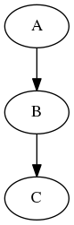

**************
graphviz-test
**************
Testing graphviz

Create .dot file
#################

``> file.dot``

Edit .dot file
###############

``digraph test {``

``A->B``

``B->C``

``}``

Create graph from .dot file
##############################

``dot -Tpng file.dot > file.png``

-T(extension of graph file)

Open .png file
################

